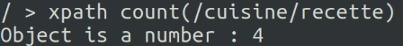

####Exercice 1
__1. /Contacts__
node root Contacts
__2. /Contacts/Person__
tous les nodes Person qui est children de node Contacts
__3. //Person[Firstname="John"]__
tous les nodes Person qui a children Firstname avec textnode = John
__4. //Person[Email]__
tous les nodes Person qui a children node Email
__5. /Contacts/Person[1]/Firstname/child::text()__
le textnode de Firstname de 1er node Persons de Contacts
__6. /Contacts/Person[1]/Firstname/text()__
le textnode de Firstname de 1er node Persons de Contacts
resultat est la meme que le precedente
__7. /Contacts//Address[@type="home"]//Street/child::text()__
le textnode de Street qui est children des tous les nodes Address avec attribute type=home qui est children de root node Contacts
__8. /Contacts//Address[@type="home" and City="London"]__
tous les nodes Address qui est children de root Contacts et qui a attribute type=home et a node children City avec valuer = London
__9./Contacts//Address[@type="work"andCity="Dublin"]/parent::node()/Lastname/text()__
le textnode de Lastname de Persons qui est children de Contact et avoir node children Address avec attribute work et children City = Dublin
__10./Contacts//Address[@type="work"andCity="Dublin"]/../Lastname/text()__
La meme que precedente
__11./Contacts[.//Address[@type="work"andCity="Dublin"]]//Lastname/text()__
afficher textnode de Lastname si dans Contact il y a un Address satisfaire le contraint
different que precedente
__12. /Contacts//Address[@type="work"]/ancestor::node()__
tous les node ancetre de node Address qui a attribute type=work
resultat = 3
/,Person,Contacts
__13./Contacts/Person[Lastname="Smith"]/following-sibling::node()/Lastname/text()__
afficher le textnode de Person qui est le suivant sibling de node Person qui a Lastname = Smith
__14./Contacts/Person[following-sibling::node()/Lastname="Dunne"]/Lastname/text()__
afficher le textnode d’un Person qui a le suivant sibling Person avec le Lastname = Dunne

####Exercice 2
__1. Toutes les compositions__
/CDlist/CD/performance/composition/child::text()

__2. Toutes les compositions ayant un soloist.__
/CDlist/CD/performance[soloist]/composition/child::text()

__3. Toutes les performances avec un seul orchestra mais pas de soloist.__
/CDlist/CD/performance[orchestra and not(soloist)]/child::text()

__4. Tous les soloists ayant jou´e avec le London Symphony Orchestra sur un CD publi´e par Deutsche Grammophon.__
/CDlist/CD[publisher="Deutsche Grammophon"]/performance[orchestra="London Symphony Orchestra"]/soloist/child::text()

__5. Tous les CDs comportant des performances du London Symphony Orchestra.__
/CDlist/CD[performance/orchestra="London Symphony Orchestra"]

####Exercice 3:
__1. Le titre du cinqui`eme livre dans la liste.__
/booker/award[5]/title/text()
-> Résultat : Hotel du Lac

__2. L’auteur du sixi`eme livre dans la liste.__
/booker/award[6]/author/text()
-> Résultat : A S Byatt

__3. Le titre du livre qui a gagné : en 2000.__
/booker/award[year='2000']/title/text()
-> Résultat : The Blind Assasin

__4. Le nom de l’auteur du livre intitul´e Possession.__
/booker/award[title='Possession']/author/text()
-> Résultat : A S Byatt

__5. Le titre des livres dont J M Coetzee est l’auteur.__
/booker/award[author='J M Coetzee']/title/text()
-> Résultat : Disgrace, Life and Times of Michael K

__6. Le nom de tous les auteurs qui ont obtenu un prix depuis 1995.__
/booker/award[year >= 1995]/author/text()
-> Résultat : Margaret Atwood, Pat Barker, J M Coetzee, Ian McEwan, Arundhati Roy, Graham Swift

__7. Le nombre total de prix décernés.__
count(/booker/award) -> Le nombre total de prix décernés est 35.

####Exercice 4:
#####Pour le recettes 1
__1. Les elements titres des recettes.__

__2. Les noms des ingr´edients.__

__3. L’element titre de la deuxieme recette.__

__4. La derniere etape de chaque recette.__

__5. Le nombre de recettes.__

__6. Les elements recette qui ont strictement moins de 7 ingredients.__

__7. Les titres des recettes qui ont strictement moins de 7 ingredients.__

__8. Les recettes qui utilisent de la farine.__

__9. Les recettes de la categorie entree.__

#####Pour le recettes 2
__1. Les elements titres des recettes.__

__2. Les noms des ingredients.__

__3. L’element titre de la deuxieme recette.__

__4. La derniere etape de chaque recette.__

__5. Le nombre de recettes.__

__6. Les elements recette qui ont strictement moins de 7 ingredients.__

__7. Les titres des recettes qui ont strictement moins de 7 ingredients.__

__8. Les recettes qui utilisent de la farine.__

__9. Les recettes de la categorie entree.__

####Exercice 5
__1.__ count(/plist/dict/key[. = 'Tracks']/following-sibling::dict[1]//dict)
__2.__
/plist/dict/key[.='Tracks']/following-sibling::dict[1]//key[.='Album']/following-sibling::string[1]/text()
__3.__ /plist/dict/key[.='Tracks']/following-sibling::dict[1]//key[.='Genre']/following-sibling::string[1]/text()
__4.__
count(/plist/dict/key[.='Tracks']/following-sibling::dict[1]//key[.='Genre']/following-sibling::string[.='Jazz'])
__5.__
distinct-values(/plist/dict/key[.='Tracks']/following-sibling::dict[1]//key[.='Genre']/following-sibling::string[1])
xpath2.0 only 
__6.__
/plist/dict/key[.='Tracks']/following-sibling::dict[1]//key[.='Play Count']/following-sibling::integer[1][.>0]/../key[.='Name']/following-sibling::string[1]/text()
__7.__
/plist/dict/key[.='Tracks']/following-sibling::dict[1]//dict[not(key='Play Count')]/key[.='Name']/following-sibling ::string[1]/text()
__8.__
/plist/dict/key[.='Tracks']/following-sibling::dict[1]//dict[not(key[.='Year']/following-sibling::integer[1]>//key[.='Year']/following-sibling::integer[1])]/key[.='Name']/following-sibling::string[1]/text()
